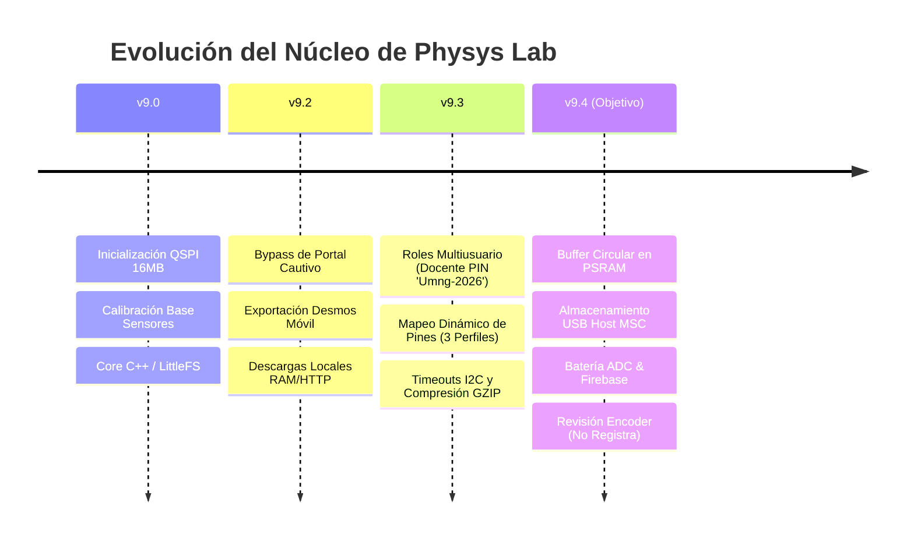

# 🔬 Checklist de Desarrollo — Physys Lab v9.4
> Hoja de ruta estratégica y estado del arte de la plataforma móvil de experimentación física de la Universidad Militar Nueva Granada.

---

## 📋 Resumen de Versiones y Evolución



---

## 🟢 Hitos Completados (Estado del Arte al Finalizar v9.3)

### 👥 1. Control Multiusuario por Roles (Evita Interferencias en Aula)
- [x] **Visualización Pública (Estudiante):** Acceso libre de solo lectura al gráfico y exportador.
- [x] **Control de Medición (Líder/Guía):** Rol protegido con PIN `1234` / `AdminUMNG`. Permite iniciar/detener capturas y tarar. Bloqueado de alterar pines y presets.
- [x] **Configuración de Hardware (Docente):** Protegido por contraseña robusta `Umng-2026`. Acceso total a edición de pines, calibraciones y reinicio de fábrica.
- [x] **Input Seguro:** Entrada de contraseña maestra del docente oculta (`type="password"`) y eliminación de pistas/placeholders del PIN por defecto.

### 🔌 2. Arquitectura de Hardware Adaptativa
- [x] **Mapeo Dinámico de Pines (NVS):** Pines de ToF, Encoder y HX711 almacenados en `Preferences` para inicialización en caliente.
- [x] **3 Perfiles Gráficos de Hardware:** 
  - `🔌 Básico` (Placas estándar sin cámara)
  - `📷 Cámara` (Evita colisión con pines strapping del bus Octal PSRAM de la placa CAM)
  - `🛠️ Personalizado` (Edición libre de GPIOs supervisada por colores de advertencia/recomendación)
- [x] **Failsafe Físico (Reset de Pines):** Presionar el botón físico **BOOT (GPIO 0)** durante 3 segundos al arrancar formatea la memoria NVS y restaura la configuración por defecto de fábrica.
- [x] **Autodetección de Cámara:** Escaneo automático del bus SCCB en la dirección `0x30` para detectar dinámicamente si la placa es tipo CAM y aplicar restricciones de pines de manera proactiva.

### ⚡ 3. Robustez y Estabilidad Operativa (Bypass de Bloqueos)
- [x] **Diagnóstico y Auditoría de Boot Loop v9.3:** Registro técnico de lecciones aprendidas y reglas de seguridad de hardware documentado en [PLAN_SOLUCION_V9.3_BOOTLOOP.md](file:///c:/Users/nelso/Documents/A_UMNG/ESP32S3%20PHYSYS%20LAB/Planes_AI/PLAN_SOLUCION_V9.3_BOOTLOOP.md).
- [x] **Timeouts en Canales I2C:** Añadido `setTimeOut(100)` a los buses `I2C_TOF` e `I2C_ENC` para evitar congelamiento de la placa si los sensores se desconectan.
- [x] **Bypass de Heap Corruption en Servidor Web:** Pre-compresión de archivos estáticos (`index.html.gz`, `app.js.gz`, `styles.css.gz`, `manual.html.gz`, `firebase-sync.js.gz`). Reduce un 80% el consumo de buffer RAM de red, acelerando la carga 10 veces.
- [x] **Bypass de Portal Cautivo Android:** Servido de datos locales de Desmos (`.desmos`) mediante descarga temporal RAM/HTTP (`POST /api/temp-export` -> `GET /api/download-export`), esquivando los bloqueos nativos del navegador móvil offline.

---

## 🎯 Planificación v9.4 (Próximos Objetivos Estratégicos)

### 📦 1. Optimización Avanzada de PSRAM y Buffer Circular (Prioridad Alta)
* **Objetivo:** Convertir el buffer de adquisición `highSpeedBuffer` (alojado en la PSRAM externa de 8MB) en un **Buffer Circular** optimizado en C++ para mediciones prolongadas de alta velocidad.
- [ ] **Desarrollo del Circular Buffer:** Implementar lógica de punteros de lectura/escritura (`head`, `tail`, `size`) para evitar fragmentación.
- [ ] **Indicador de Buffer en la Web:** Añadir barra de progreso visual que muestre en tiempo real qué porcentaje de la memoria externa se ha ocupado en la sesión de captura actual.
- [ ] **Mapeo de Variables Cinemáticas:** Garantizar la coherencia del cálculo continuo de velocidad y aceleración sobre el buffer circular sin desbordamiento.

### 💾 2. Almacenamiento USB Host MSC (Estabilidad Híbrida)
* **Objetivo:** Habilitar el guardado autónomo directo en llaves de memoria USB tipo pendrive para prácticas en el campo sin PC ni celular.
- [ ] **Failsafe del Driver USB Host:** Estabilizar el montaje físico de la partición FAT32/exFAT del pendrive.
- [ ] **Prueba de Escritura Masiva:** Validar la transferencia de archivos CSV de telemetría mayores a 1MB.
- [ ] **Control de Errores Visuales:** Notificar estados de montaje usando el LED de estado (ej: **Magenta** = USB no detectado/Formato incorrecto, **Blanco** = Escribiendo en USB).

### 🔋 3. Monitoreo de Energía y ADC de Batería
* **Objetivo:** Proporcionar al estudiante y docente información en tiempo real sobre la autonomía del laboratorio portátil.
- [ ] **Lectura del ADC de Batería:** Configurar un canal ADC (usando un pin recomendado como `GPIO 4` con divisor resistivo) para medir el voltaje de la celda de Litio (LiPo).
- [ ] **Widget en la Interfaz Web:** Agregar un icono de batería con porcentaje en la barra de navegación web.

### ☁️ 4. Cloud Integration (Sincronización Firebase)
* **Objetivo:** Permitir a los estudiantes subir sus datos del laboratorio offline a la base de datos central de la UMNG una vez que recuperen conectividad a internet (en casa o biblioteca).
- [ ] **Lógica Offline Persistence:** Asegurar que los experimentos se almacenen en el navegador del estudiante (IndexedDB) de forma indefinida.
- [ ] **Botón "Subir a la Nube" (Sync):** Implementar la carga segura a Firebase mediante el módulo `firebase-sync.js`.
- [ ] **Visualización UMNG Cloud:** Conectar con el portal de investigación para almacenamiento unificado de prácticas.

### 🔄 5. Revisión del Sensor Encoder (Sin Registro de Datos)
* **Objetivo:** Investigar y solucionar el fallo por el cual el sensor encoder no registra ni reporta mediciones en el flujo de telemetría.
- [ ] **Diagnóstico de Conectividad e I2C:** Verificar si el encoder responde en su dirección I2C correspondiente sin provocar bloqueos o interrupciones en la línea de datos.
- [ ] **Validación de Asignación y Mapeo:** Confirmar que los pines dinámicos asignados al encoder no colisionen con pines de strapping o buses reservados de la placa (en especial en el entorno CAM).
- [ ] **Depuración de Adquisición en C++:** Revisar las funciones del encoder en `src/main.cpp` para asegurar que las lecturas y actualizaciones de pulsos/ángulos se realicen de forma estable y fluida.

---

## 📐 Hoja de Ruta de Compilación y Flasheo v9.4

> [!WARNING]
> Recuerda compilar siempre utilizando el entorno correcto según la tarjeta de tu mesa:
> - **Tarjeta Base (Devkit):** `pio run -e esp32s3base`
> - **Tarjeta CAM (Cámara):** `pio run -e esp32s3cam`

```powershell
# Compilar e inicializar el entorno v9.4
pio run -e esp32s3base

# Cargar Firmware del Núcleo
pio run -e esp32s3base -t upload

# Cargar Recursos Web Pre-Comprimidos (LittleFS)
pio run -e esp32s3base -t uploadfs
```

---
*Este documento define las bases técnicas y de arquitectura para el desarrollo de la versión 9.4.*
