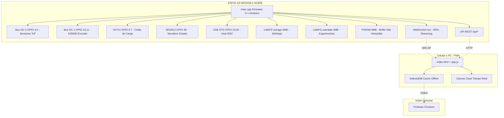
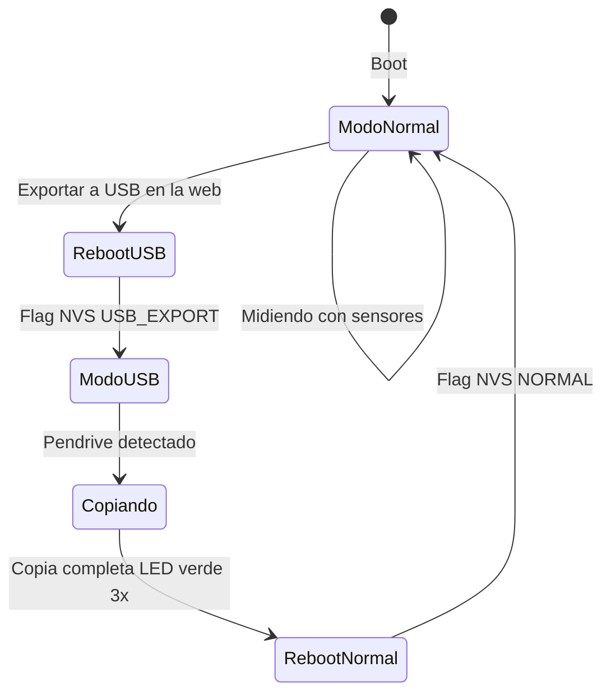

# 📘 Manual de Instrucciones — Physys Lab ESP32-S3
> **Versión:** v8.0 | **Fecha:** Mayo 2026  
> **Hardware:** ESP32-S3 WROOM-1 (N16R8) — Freenove Pinout  
> **Acceso Web:** http://physyslab.local

---

## 📋 Índice

1. [Arquitectura del Sistema](#arquitectura)
2. [Mapa de Archivos](#mapa-de-archivos)
3. [Hitos Completados](#hitos-completados)
4. [Configuración de Hardware](#configuración-de-hardware)
5. [Procedimiento de Quemado](#procedimiento-de-quemado)
6. [Sensores Soportados](#sensores-soportados)
7. [Semáforo LED de Estado](#semáforo-led)
8. [USB Host MSC — Exportación a Pendrive](#usb-host-msc)
9. [Sincronización Firebase](#sincronización-firebase)
10. [Buffer PSRAM de Alta Velocidad](#buffer-psram)
11. [Uso en Campo](#uso-en-campo)
12. [API REST y WebSocket](#api)
13. [Checklist de Pendientes](#checklist-pendientes)

---

## 1. Arquitectura del Sistema



### Tabla de Particiones (16MB Flash)

| Partición | Tipo | Tamaño | Uso |
|-----------|------|--------|-----|
| app0 | App | 6 MB | Firmware compilado |
| storage | LittleFS | 6 MB | WebApp + Archivos estáticos |
| userdata | LittleFS | 4 MB | Datos de experimentos |

---

## 2. Mapa de Archivos

### Firmware (C++ — se compila y flashea)

| Archivo | Función |
|---------|---------|
| `src/main.cpp` | Cerebro del sistema. ~1078 líneas. WiFi AP, sensores, WebSocket, API, LED, USB Host, PSRAM buffer |
| `src/UsbHostMSC.h` | Wrapper para USB Host MSC nativo de ESP-IDF |
| `src/idf_component.yml` | Dependencia de `espressif/usb_host_msc` (componente nativo) |
| `platformio.ini` | Configuración PlatformIO: ESP32-S3, 16MB Flash QIO, librerías |
| `partitions.csv` | Tabla de particiones: app0 (6MB), storage (6MB), userdata (4MB) |

### WebApp (se sube como LittleFS)

| Archivo | Función |
|---------|---------|
| `data/www/index.html` | PWA: 5 pestañas (Movimiento, Rotación, Fuerza, Editor Python, GPIO Viewer) |
| `data/www/app.js` | Lógica principal (~1576 líneas): WebSocket, tabs, charts, recording, export |
| `data/www/styles.css` | Tema oscuro premium: glassmorphism, neon-text, animaciones |
| `data/www/firebase-sync.js` | Módulo H5: IndexedDB + Firestore + Auth anónima |
| `data/www/source.cpp` | **CRÍTICO** — Archivo fuente para OTA. NO ELIMINAR |
| `data/www/sw.js` | Service Worker para PWA offline |
| `data/www/manifest.json` | Manifiesto PWA |
| `data/config.json` | Branding UMNG: institución, versión, tema |
| `data/sensor_logic.py` | Script Python de configuración del perfil de sensor |

### Carpeta de Producción (SOLO LECTURA)

| Carpeta | Contenido |
|---------|-----------|
| `produccion/` | Snapshot de referencia del firmware estable. No modificar. |

---

## 3. Hitos Completados

| Hito | Estado | Descripción |
|------|--------|-------------|
| **H1** | ✅ | Núcleo Base C++ — Servidor Web, Portal Cautivo, Particiones 6/6/4 MB |
| **H2** | ✅ | WebApp PWA — Canvas Chart, WebSocket streaming 30Hz |
| **H3** | ✅ | Editor Python — 3 ejemplos (ToF, Encoder, Celda de Carga) |
| **H4** | ✅ | GPIO Viewer — Visualización de 35 pines en tiempo real |
| **H5** | ✅ | Firebase Sync — IndexedDB + Firestore + Auth anónima |
| **H6** | ✅ | Factory Reset + Branding UMNG personalizable |

### Mejoras Post-Hitos

| Mejora | Estado | Descripción |
|--------|--------|-------------|
| I2C Dual | ✅ | Buses separados: ToF en GPIO 4/5, Encoder en GPIO 10/11 |
| Start/Stop por Sensor | ✅ | Botones individuales para ToF, Encoder, HX711 |
| Selector de Tiempo | ✅ | ms / s / min en el eje X del gráfico |
| mDNS | ✅ | Acceso vía http://physyslab.local |
| CORS | ✅ | Headers Access-Control-Allow-Origin |
| SSID con MAC | ✅ | Physys-Lab-XXXX único por dispositivo |
| Modo Gatillo | ✅ | Zona muerta + fin de carrera automático |
| USB Host MSC | ✅ | Modo híbrido boot (Normal / USB Export) con NVS |
| Buffer PSRAM | ✅ | 60,000 muestras en RAM externa |
| Multi-sensor ToF | ✅ | VL53L0X, VL53L1X, VL6180X, VL53L5CX seleccionables |
| Filtro HX711 | ✅ | EMA digital + modo 16-bit alta estabilidad |

---

## 4. Configuración de Hardware

### Pinout

| GPIO | Función | Protocolo |
|------|---------|-----------|
| 4 | TOF_SDA | I2C Bus #0 |
| 5 | TOF_SCL | I2C Bus #0 |
| 6 | HX711_DT | Digital |
| 7 | HX711_SCK | Digital |
| 10 | ENC_SDA | I2C Bus #1 |
| 11 | ENC_SCL | I2C Bus #1 |
| 19 | USB D- | USB OTG |
| 20 | USB D+ | USB OTG |
| 48 | WS2812 LED | RMT/FastLED |
| 0 | BOOT (Factory Reset 10s) | Input Pullup |

### Frecuencia I2C
- Ambos buses operan a **400 kHz** (Fast Mode)

---

## 5. Procedimiento de Quemado

> [!CAUTION]
> El botón BOOT del hardware actual está dañado físicamente. Solo se puede flashear por UART manual.

### Paso a paso

```bash
# 1. Compilar firmware
pio run

# 2. Subir firmware + filesystem
pio run -t upload -t uploadfs

# 3. Solo firmware (cambios en main.cpp)
pio run -t upload

# 4. Solo filesystem (cambios en data/)
pio run -t uploadfs
```

### Build Flags Críticas

```ini
build_flags = 
    -D BOARD_HAS_PSRAM
    -mfix-esp32-psram-cache-issue
    -D CORE_DEBUG_LEVEL=3
    -D ARDUINO_USB_MODE=1
    -D ARDUINO_USB_CDC_ON_BOOT=1
```

> [!IMPORTANT]
> ARDUINO_USB_CDC_ON_BOOT=1 habilita la programación por USB nativo. Sin esto, el puerto COM desaparece.

---

## 6. Sensores Soportados

### Selección de Sensor ToF

Se configura desde la interfaz web o vía NVS. Cambio aplica tras reinicio.

| Modelo | Rango | Dirección I2C | Uso Ideal |
|--------|-------|---------------|-----------|
| **VL53L0X** | 30 — 2000 mm | 0x29 | Cinemática básica, carritos |
| **VL53L1X** | 40 — 4000 mm | 0x29 | Caída libre desde altura |
| **VL6180X** | 10 — 600 mm | 0x29 | Péndulos cortos, alta precisión |
| **VL53L5CX** | 20 — 4000 mm | 0x29 | Multizona 8x8, promedio central |

### Perfil Python (data/sensor_logic.py)

```python
sensor = "VL53L0X"
frecuencia_hz = 100
duracion_s = 10
dist_min = 30    # mm
dist_max = 2000  # mm
```

---

## 7. Semáforo LED de Estado

| Color | RGB | Significado |
|-------|-----|-------------|
| Blanco tenue | (20, 20, 20) | Sistema listo |
| Naranja | Orange | Esperando Gatillo (Toma de muestra) |
| Azul | Blue | Grabando datos |
| Verde (3x blink) | Green | Experimento guardado |
| Amarillo | Yellow | Inicializando / Flash llena |
| Magenta | (255,0,255) | Error en sensores o script |
| Rojo | Red | Factory Reset activado |

---

## 8. USB Host MSC — Exportación a Pendrive

### Arquitectura Híbrida (Modo Dual Boot)



### Procedimiento para el Estudiante
1. En la app web, toca "Exportar a USB"
2. Aparece mensaje: "Conecta el pendrive y espera..."
3. ESP32 se reinicia (LED amarillo)
4. Conectar pendrive USB con cable OTG
5. LED azul = copiando datos
6. LED verde 3x = Listo. Retirar pendrive
7. ESP32 se reinicia automáticamente a modo normal

### Dependencia Nativa
```yaml
# src/idf_component.yml
dependencies:
  espressif/usb_host_msc: "^1.1.4"
```

> [!WARNING]
> No se puede programar por USB mientras el pendrive está conectado. Son mutuamente excluyentes.

---

## 9. Sincronización Firebase

### Flujo Offline-First

```
ESP32 AP sin internet -> Phone PWA -> IndexedDB local -> Firestore Cloud
```

- El módulo firebase-sync.js detecta conectividad
- Almacena experimentos en IndexedDB mientras no hay internet
- Sincroniza automáticamente al conectar a red con internet
- Autenticación: Anónima (sin login para estudiantes)

> [!NOTE]
> NO se modifica main.cpp para Firebase. Todo es frontend.

---

## 10. Buffer PSRAM de Alta Velocidad

### Configuración

```cpp
struct DataPoint {
  uint32_t t;      // Tiempo relativo (ms)
  float dist;      // Distancia (mm)
  float vel;       // Velocidad (m/s)
  float weight;    // Peso (g)
  float angle;     // Angulo (grados)
};

#define MAX_SAMPLES 60000
DataPoint* highSpeedBuffer = nullptr;  // ~1.5 MB en PSRAM
```

### Comportamiento
- Se reserva al arrancar con ps_malloc()
- Cada lectura válida durante medición se almacena
- El índice se reinicia al iniciar nueva medición
- Permite captura a 100Hz sin cuello de botella

---

## 11. Uso en Campo

### Checklist de Preparación
- [ ] Verificar firmware actualizado (pio run -t upload)
- [ ] Verificar filesystem (pio run -t uploadfs)
- [ ] Confirmar que data/www/source.cpp existe
- [ ] Cargar batería o fuente portátil
- [ ] Llevar cable OTG + pendrive FAT32
- [ ] Verificar sensor ToF correcto seleccionado

### Flujo de Uso
1. Encender ESP32 -> LED amarillo (inicializando)
2. LED blanco tenue -> Sistema listo
3. Conectar celular a WiFi "Physys-Lab-XXXX"
4. Abrir http://physyslab.local en el navegador
5. Seleccionar pestaña del sensor activo
6. Presionar play para iniciar medición -> LED azul
7. Presionar stop para detener -> LED verde 3x blink -> blanco
8. Exportar datos vía JSON o USB

---

## 12. API REST y WebSocket

### Endpoints REST

| Método | Ruta | Descripción |
|--------|------|-------------|
| GET | /api/status | Estado del sistema (heap, PSRAM, sensores) |
| GET | /api/config | Branding UMNG (config.json) |
| GET | /api/gpio | Estado de 35 pines GPIO |
| POST | /api/data | Guardar experimento en userdata |
| GET | /api/export | Exportar todos los experimentos |
| GET | /api/data/list | Listar archivos con tamanos |
| DELETE | /api/data/clear | Limpiar todos los datos |
| GET | /api/python | Leer script Python actual |
| POST | /api/python | Guardar script Python |
| GET | /api/storage | Info de almacenamiento |

### Comandos WebSocket (/ws)

| Comando | Acción |
|---------|--------|
| START | Iniciar medición global |
| STOP | Detener medición global |
| START_TOF / STOP_TOF | Control por sensor |
| START_ENC / STOP_ENC | Control por sensor |
| START_HX / STOP_HX | Control por sensor |
| RESET_ENC | Poner ángulo a cero |
| INVERT_ENC | Invertir sentido de giro |
| TOGGLE_HX_FILTER | Activar/desactivar filtro EMA |
| TOGGLE_HX_STABILITY | Modo 16-bit alta estabilidad |
| TARE | Tarar celda de carga |
| SET_TOF:modelo | Cambiar modelo ToF |
| SET_RATE:ms | Cambiar frecuencia de muestreo |
| START_TRIGGER | Activar modo gatillo |
| SET_TUBE:mm | Definir largo del tubo |
| USB_EXPORT | Reiniciar en modo exportación USB |
| REBOOT | Reiniciar dispositivo |

---

## 13. Checklist de Pendientes

### Análisis y Datos
- [ ] Optimización PSRAM: Verificar que el board reconoce la PSRAM (build flags)
- [ ] Volcado de Buffer: Implementar endpoint para descargar el buffer PSRAM como CSV

### Cloud (H5)
- [ ] Sincronización Firebase: Implementar Bulk Upload real con proyecto Firebase configurado

### Fork TOF-Only
- [ ] Crear fork: Versión simplificada solo con sensores de distancia ToF
- [ ] Eliminar dependencias: AS5600, HX711
- [ ] Simplificar UI: Una sola pestaña de medición

### Pruebas de Campo
- [ ] Test USB Export: Verificar con pendrive FAT32 real
- [ ] Test mDNS: Confirmar acceso physyslab.local en Android y iOS
- [ ] Test PSRAM: Verificar mensaje PSRAM Buffer listo en monitor serie

---

> [!IMPORTANT]
> **Fuente de Verdad:** Este manual consolida la información de todos los planes en Planes_AI/.
> Ante cualquier duda, este documento prevalece.
