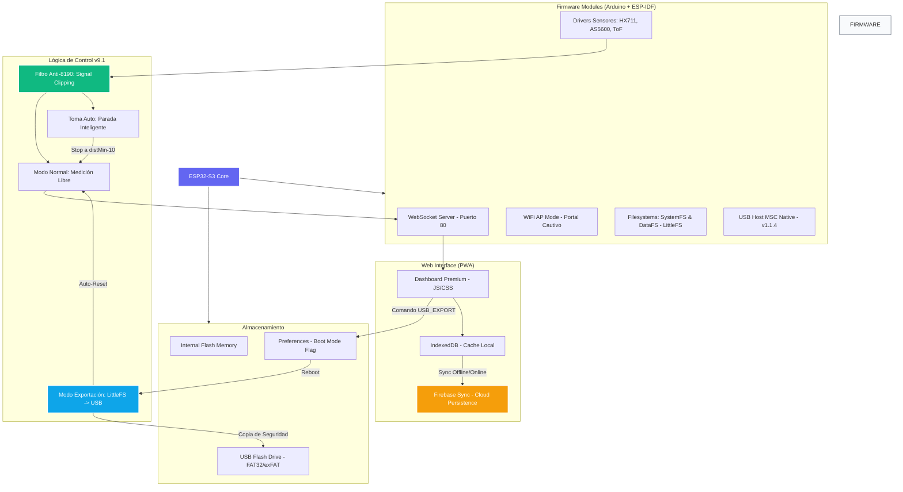

# Mapa del Proyecto Physys Lab - GraphyFYY 🚀

Este diagrama representa la arquitectura integral del sistema, incluyendo la reciente implementación del modo híbrido USB y la sincronización con la nube.

## Directorio de Archivos Críticos

| Carpeta / Archivo | Función |
| :--- | :--- |
| `src/main.cpp` | Lógica principal, Filtro Anti-8190 y Paradas Inteligentes. |
| `src/idf_component.yml` | Dependencia nativa `espressif/usb_host_msc`. |
| `data/www/` | Frontend de la aplicación (Dashboard + Lógica JS). |
| `Planes_AI/` | Documentación técnica persistente (Checklists, Mapas). |

## Estado de Implementación
- [x] **H1-H4**: Sensores y UI Base.
- [x] **H5**: Preparación Sincronización Firebase.
- [x] **H6**: Modo Híbrido USB Host MSC.
- [x] **H8 (NUEVO)**: Estabilización v9.1 (Filtro de señal y Parada 10mm).
- [ ] **H9**: Escritura masiva a USB Pendrive.
