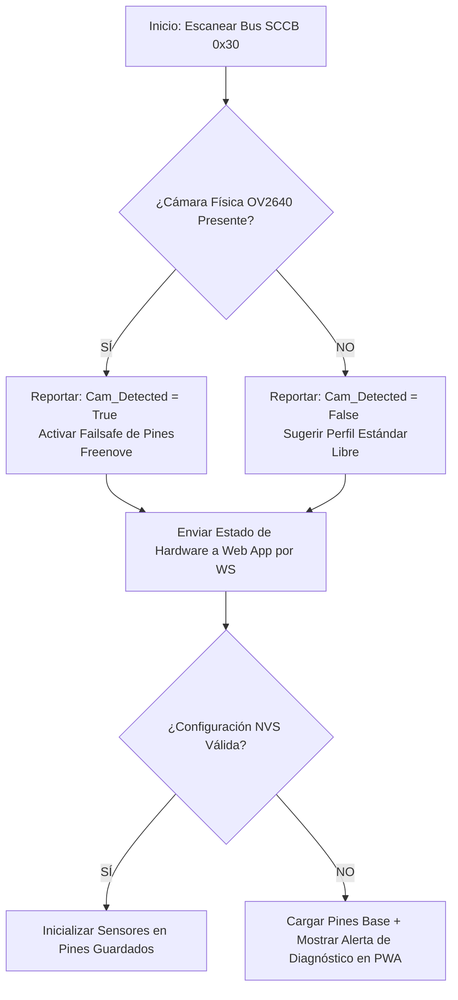

# 📋 Plan de Trabajo v9.3 — Mapeo Dinámico de Pines y Control Multiusuario por Roles

**Para:** UMNG Physics Lab — Plataforma Kinematics v9.3  
**Estado:** 📜 *Documento de Planificación y Arquitectura*  
**Regla de Oro:** 🛑 *Cero modificaciones al código de producción actual hasta aprobación explícita.*  

---

## 1. Justificación y Objetivos del Plan v9.3

En el trabajo de campo en los laboratorios de física de la UMNG, se han identificado dos retos críticos:
1.  **Variabilidad de Hardware:** Los diferentes grupos de estudiantes poseen placas de desarrollo diversas (con y sin cámara), lo que genera conflictos físicos en el mapeo de pines del bus de sensores (ToF, Encoder, Celda de Carga).
2.  **Interferencia Multiusuario:** Dado que las mesas de trabajo están muy juntas, múltiples estudiantes se conectan al mismo Punto de Acceso WiFi (`Physys-Lab`). Esto provoca que varios intenten iniciar/parar mediciones o borrar datos al mismo tiempo, generando lentitud, pérdida de telemetría y caos en el experimento.

### Objetivos Clave de la Versión v9.3:
*   **Mapeo Adaptativo de Pines:** Inicializar los sensores dinámicamente según el hardware detectado en el arranque, configurable de forma gráfica desde la PWA.
*   **Esquema de Permisos y Roles por Mesa:** Impedir la interferencia bloqueando las acciones de control (Grabar, Tarar, Borrar) tras una clave de acceso, permitiendo que la mayoría de los estudiantes observen en tiempo real sin capacidad de sabotear el experimento de su grupo.

---

## 2. Especificación Técnica: Control Multiusuario por Roles

Implementaremos un sistema de autenticación ligero basado en WebSockets y memoria no volátil (NVS), sin necesidad de conectarse a internet.

### A. Definición de Roles y Permisos

| Permiso / Acción | Estudiante 👤 | Guía de Grupo 👥 | Docente / Monitor 🎓 |
| :--- | :---: | :---: | :---: |
| **Acceso a Web App** | ✅ Libre | ✅ Libre | ✅ Libre |
| **Visualización en Tiempo Real** | ✅ Sí | ✅ Sí | ✅ Sí |
| **Descarga de Datos (CSV/Desmos/HTML)** | ✅ Sí | ✅ Sí | ✅ Sí |
| **Iniciar/Detener Medición** | ❌ No (Bloqueado) | ✅ Sí | ✅ Sí |
| **Tarar Celda / Resetear Cero** | ❌ No (Bloqueado) | ✅ Sí | ✅ Sí |
| **Borrar Archivos del ESP32** | ❌ No | ❌ No | ✅ Sí |
| **Modificar Pines (GPIO)** | ❌ No | ❌ No | ✅ Sí |
| **Reiniciar Dispositivo** | ❌ No | ❌ No | ✅ Sí |
| **Editar Lógica Python** | ❌ No | ❌ No | ✅ Sí |

### B. El Mecanismo de Bloqueo de Interferencia (Bloqueo de Canal Único)
Para resolver el problema de varios alumnos presionando botones al mismo tiempo:
1.  **Líder Único Activo:** Solo **un cliente WebSocket** a la vez puede tener el rol de "Guía" activo con capacidad de escritura.
2.  **Intento de Sabotaje:** Si un estudiante en la misma mesa intenta autenticarse como Guía mientras otro ya lo está, la interfaz mostrará un aviso:
    > ⚠️ **Mesa Ocupada:** El estudiante de la IP `192.168.4.2` ya tiene el control de la medición de este grupo. Puedes ver y descargar los datos, pero no alterarlos.
3.  **Liberación de Control:** Si el Guía cierra la app o se desconecta por más de 10 segundos, el canal de control se libera automáticamente para otro miembro del grupo.

### C. Sistema de Claves por Defecto (Configurables en NVS)
*   **Clave Guía:** PIN numérico rápido de 4 dígitos (Ej: `1234` o `Mesa 1` -> `0001`).
*   **Clave Docente:** Contraseña maestra de seguridad (Ej: `AdminUMNG`).

---

## 3. Especificación Técnica: Pines Dinámicos e Integración con GPIO Viewer

El **GPIO Viewer** actual en la web pasará de ser un mero visor estático a un panel interactivo inteligente de diagnóstico y configuración.

### A. Elementos Visuales Nuevos en el GPIO Viewer:
1.  **Filtro Visual de Conflictos:** Cuando el docente entre al menú interactivo para reconfigurar un pin, los GPIOs reservados por la cámara brillarán en **Amarillo/Naranja** indicando advertencia. Los pines recomendados brillarán en **Verde/Oro** (`GPIO 1, 2, 3, 14, 21, 26`).
2.  **Selector Gráfico Directo:** Al hacer clic en un pin libre en la placa del GPIO Viewer, se abrirá un tooltip contextual que permitirá al docente reasignarlo instantáneamente:
    *   *Ejemplo:* Clic en `GPIO 1` -> `[ Asignar a: ToF SDA | Liberar Pin ]`.
3.  **Confirmación y Reinicio LED:** Al guardar, el ESP32 destellará en color **Cian** y se reiniciará en 2 segundos para aplicar los cambios de bus de hardware físicamente.

---

## 4. Plan de Ruta para Implementación Segura

Para garantizar la estabilidad del software principal que funciona a la perfección, la implementación se dividirá en micro-fases validadas una a una:

### Fase 1: Capa de Seguridad NVS e Inicialización Dinámica (Firmware C++)
- [x] Modificar `src/main.cpp` para declarar las variables globales de pines de sensores (`TOF_SDA`, etc.) y cargarlos desde `Preferences` en `setup()`. (Completado)
- [x] Añadir en `setup()` la autodetección de cámara OV2640 mediante un escaneo del bus SCCB en la dirección `0x30`. (Completado)
- [x] Implementar la seguridad física: Si el botón físico **BOOT (GPIO 0)** se mantiene presionado 3 segundos al encender, borrar NVS y restaurar el perfil de pines base. (Completado)
- [x] **Mejora del GPIO Viewer (Completado):** Expandir el endpoint `/api/gpio` en `main.cpp` para retornar todos los pines físicos disponibles (con GPIO 26 incluido) y mapear dinámicamente sus roles en tiempo real.

### Fase 2: Protocolo WebSockets y Manejo de Roles (Firmware + JS)
- [x] Integrar el control de roles en `AsyncWebSocket`. Guardar la sesión activa del "Líder" por IP. (Completado)
- [x] Modificar los comandos entrantes de control (`START`, `STOP`, `TARE`, `RESET_ENC`, `SET_PINS`) para que el ESP32 verifique si el cliente WebSocket remitente tiene permisos de Guía (Líder) o Docente. (Completado)
- [x] **Filtro de Seguridad (Completado):** Resolver por completo la fuga de seguridad en el formulario de login. Se cambiaron los placeholders que revelaban el PIN `1234` y la contraseña `AdminUMNG` por textos genéricos, y se protegió la visualización de la contraseña del docente convirtiendo el campo a tipo `password`.

### Fase 3: Interfaz Web Dinámica (UI/UX en app.js e index.html)
- [x] **Barra de Estado de Rol:** Mostrar en el header de la web el rol activo: `👤 Estudiante (Solo Lectura)`, `👥 Guía (Control)` o `🎓 Docente (Admin)`. (Completado)
- [x] **Bloqueo Visual de Botones:** Si el rol es *Estudiante*, los botones de acción se mostrarán semi-transparentes o con candado visual. (Completado)
- [x] **Mapeo Dinámico y 3 Perfiles de Pines (Completado):** Añadido un menú interactivo en la sección docente/líder con las 3 opciones de perfiles solicitadas:
  *   **🔌 Básico** (ToF 4/5, Encoder 10/11, HX711 6/7)
  *   **📷 Cámara** (ToF 1/2, Encoder 3/14, HX711 21/26)
  *   **🛠️ Personalizado** (Edición libre de GPIOs)
- [x] **Acceso Ampliado de Edición (Completado):** Permitir tanto al Líder de Mesa (Monitor con estrella ⭐) como al Docente acceder a la edición de pines y mandar la reasignación de hardware mediante el WebSocket.

---

## 5. Garantía de Estabilidad del Laboratorio de Bolsillo

> [!IMPORTANT]
> **Preservación Operativa:**
> Durante toda la fase de construcción de la v9.3, la carpeta `produccion/` **permanecerá 100% intacta** con el código de la v9.2 que ya está probado en campo y funciona de manera brillante con Desmos. 
> Todos los desarrollos de la v9.3 se harán exclusivamente en ramas de prueba o bajo archivos de desarrollo controlados hasta que el Profesor Nelson valide la versión final.

---
*Este plan queda registrado en la documentación del proyecto para tu revisión y comentarios.*
