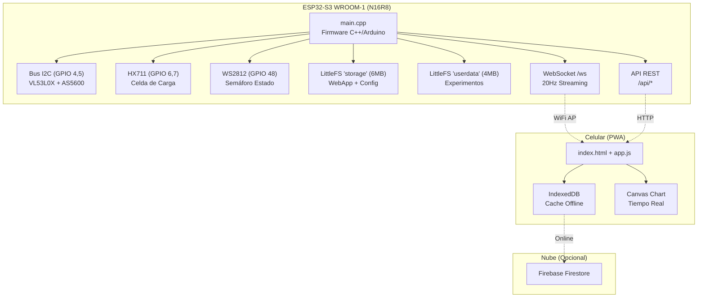
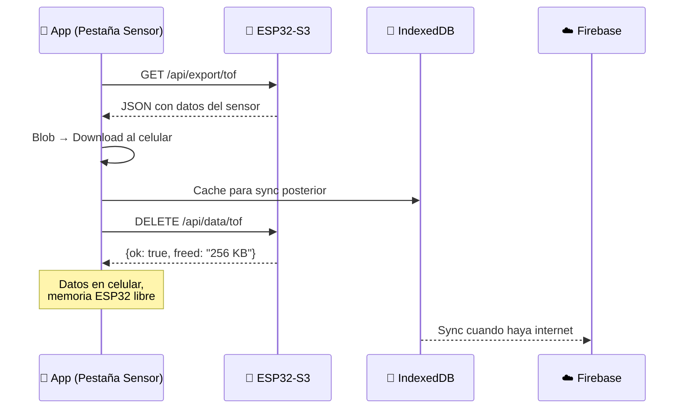
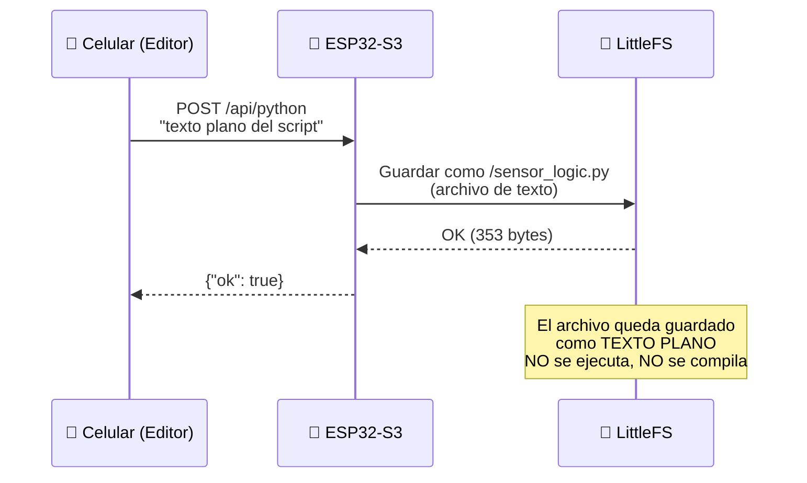

# Physys Lab — Resumen del Proyecto, Análisis del Árbol de Aprendizaje y Plan de Mejoras

## 📊 Estado Actual del Proyecto

### Git
- **Branch:** `master`  
- **Último commit:** `285d6f5` — Agregar árbol de aprendizaje de código (16 ejemplos pedagógicos)
- **Commits totales:** 3 (H1-H4+H6 → H5 → Árbol de aprendizaje)

> [!IMPORTANT]
> **GitHub:** No hay un remote configurado. Para subir a GitHub necesitas:
> 1. Crear un repositorio en GitHub (ej: `ESP32S3-Physys-Lab`)
> 2. Ejecutar:
> ```bash
> git remote add origin https://github.com/TU_USUARIO/ESP32S3-Physys-Lab.git
> git push -u origin master
> ```
> Proporcióname tu nombre de usuario de GitHub o la URL del repo y lo configuro por ti.

### Hitos Completados (6/6 ✅)

| Hito | Estado | Descripción |
|------|--------|-------------|
| **H1** | ✅ | Núcleo Base C++ — Servidor Web, Portal Cautivo, Particiones 6/6/4 MB |
| **H2** | ✅ | WebApp PWA — Canvas Chart, Streaming WebSocket 20Hz |
| **H3** | ✅ | Editor Python — 3 ejemplos (ToF, Encoder, Celda de Carga) |
| **H4** | ✅ | GPIO Viewer — Visualización de 35 pines en tiempo real |
| **H5** | ✅ | Firebase Sync — IndexedDB + Firestore + Auth anónima |
| **H6** | ✅ | Factory Reset + Branding UMNG personalizable |

---

## 🗂 Archivos que Hacen Funcionar el Proyecto

### Firmware (C++ — se compila y flashea al ESP32-S3)

| Archivo | Función |
|---------|---------|
| [main.cpp](file:///c:/Users/nelso/Documents/A_UMNG/ESP32S3%20PHYSYS%20LAB/src/main.cpp) | **Cerebro del sistema.** 534 líneas. Inicializa WiFi AP "Physys-Lab", sensores I2C (VL53L0X + AS5600 + HX711), WebSocket streaming a 20Hz, API REST (/api/status, /api/data, /api/python, /api/gpio, /api/export, /api/storage, /api/config), LED semáforo, Factory Reset |
| [platformio.ini](file:///c:/Users/nelso/Documents/A_UMNG/ESP32S3%20PHYSYS%20LAB/platformio.ini) | Configuración PlatformIO: ESP32-S3, 16MB Flash QIO, PSRAM QSPI, librerías (ESPAsyncWebServer, ArduinoJson, VL53L0X, AS5600, HX711, FastLED) |
| [partitions.csv](file:///c:/Users/nelso/Documents/A_UMNG/ESP32S3%20PHYSYS%20LAB/partitions.csv) | Tabla de particiones: app0 (6MB), storage (6MB LittleFS), userdata (4MB LittleFS) |

### WebApp (se sube como LittleFS al ESP32-S3)

| Archivo | Función |
|---------|---------|
| [index.html](file:///c:/Users/nelso/Documents/A_UMNG/ESP32S3%20PHYSYS%20LAB/data/www/index.html) | PWA shell: 5 pestañas (Movimiento, Rotación, Fuerza, Editor Python, GPIO Viewer), cards glassmorphism, gráfico Canvas |
| [app.js](file:///c:/Users/nelso/Documents/A_UMNG/ESP32S3%20PHYSYS%20LAB/data/www/app.js) | Lógica principal (723 líneas): WebSocket client, tab switching, chart rendering, recording, export JSON, GPIO polling, Python editor |
| [styles.css](file:///c:/Users/nelso/Documents/A_UMNG/ESP32S3%20PHYSYS%20LAB/data/www/styles.css) | Tema oscuro premium: glassmorphism, neon-text, animaciones, responsive |
| [firebase-sync.js](file:///c:/Users/nelso/Documents/A_UMNG/ESP32S3%20PHYSYS%20LAB/data/www/firebase-sync.js) | Módulo H5: IndexedDB cache offline + Firestore cloud sync + Auth anónima |
| [sw.js](file:///c:/Users/nelso/Documents/A_UMNG/ESP32S3%20PHYSYS%20LAB/data/www/sw.js) | Service Worker para PWA offline |
| [manifest.json](file:///c:/Users/nelso/Documents/A_UMNG/ESP32S3%20PHYSYS%20LAB/data/www/manifest.json) | Manifiesto PWA (nombre, colores, iconos) |

### Configuración

| Archivo | Función |
|---------|---------|
| [config.json](file:///c:/Users/nelso/Documents/A_UMNG/ESP32S3%20PHYSYS%20LAB/data/config.json) | Branding UMNG: nombre de institución, versión, tema |
| [sensor_logic.py](file:///c:/Users/nelso/Documents/A_UMNG/ESP32S3%20PHYSYS%20LAB/data/sensor_logic.py) | Script Python placeholder del estudiante |

### Diagrama de Arquitectura



---

## 🌳 Análisis del Árbol de Aprendizaje

Los 16 ejemplos siguen una **progresión pedagógica V1→V4** consistente para cada sensor:

### Patrón de Progresión

| Nivel | Qué se aprende | Tecnologías |
|-------|----------------|-------------|
| **V1** | Lectura serial básica + cinemática | `Wire.h` + librería del sensor → Serial Monitor |
| **V2** | Filtros adaptativos, calibración | EMA, unwrap angular, banda muerta |
| **V3** | WebServer local + página HTML | WiFi AP + `ESPAsyncWebServer` + LittleFS → gráfica web |
| **V4** | Red única con MAC + portal cautivo | `esp_mac.h` para SSID único, DNS captive portal |

### Detalles por Sensor

#### 🔄 AS5600 (Encoder Magnético) — 4 versiones
- **V1:** I2C en GPIO 10/11 (¡diferente del main.cpp!), unwrap angular, calcula ω y α  
- **V2:** Agrega filtros  
- **V3:** WebServer con gráfica local  
- **V4:** Red única `PhySyS-Ang-XXXX` por MAC, pines DIR (GPIO16) y GPO (GPIO17), endpoint `/toggleDIR` para invertir sentido remotamente  

> [!TIP]
> **Mejora clave:** Los ejemplos usan GPIO 10/11 para AS5600, separado del VL53 en GPIO 4/5. Esto ya implementa buses I2C separados.

#### 📏 VL53L1X (ToF Distancia) — 4 versiones
- **V1:** I2C en GPIO 4/5, modo Long (hasta 4m), calcula d, v, a  
- **V4:** WiFi AP con MAC única `PhySyS-XXXX`, endpoint `/datos`, filtrado de timeout y rango (0-5m)

> [!WARNING]
> El main.cpp usa librería **VL53L0X** (rango máx ~1.2m), pero los ejemplos usan **VL53L1X** (rango hasta 4m). Inconsistencia que debe resolverse.

#### 📏 VL6180X (ToF Corta Distancia) — 4 versiones
- Similar al VL53L1X pero para rangos cortos (~200mm)

#### ⚖️ HX711 (Celda de Carga) — 4 versiones
- **V1:** Calibración interactiva por Serial, filtro adaptativo EMA (ALPHA_LENTO/RÁPIDO), banda muerta  
- **V4:** WiFi AP + endpoint `/datos` y `/tara`, factor de calibración precalculado

---

## 🚀 Plan de Mejoras Propuestas

### Fase 1: I2C Dual — Buses Separados (Interferencia Multi-ESP32)

**Problema:** Cuando hay varios ESP32-S3 cerca, los buses I2C compartidos generan interferencia.  
**Solución:** Usar dos buses `TwoWire` independientes.

#### Cambios en [main.cpp](file:///c:/Users/nelso/Documents/A_UMNG/ESP32S3%20PHYSYS%20LAB/src/main.cpp)

```diff
-#define I2C_SDA        4    // GPIO4 — Bus I2C compartido
-#define I2C_SCL        5    // GPIO5
+// Bus I2C #0 — ToF VL53L1X (dirección 0x29)
+#define TOF_SDA        4    // GPIO4
+#define TOF_SCL        5    // GPIO5
+// Bus I2C #1 — AS5600 Encoder (dirección 0x36)
+#define ENC_SDA        10   // GPIO10
+#define ENC_SCL        11   // GPIO11

+TwoWire I2C_TOF = TwoWire(0);   // Bus 0 para ToF
+TwoWire I2C_ENC = TwoWire(1);   // Bus 1 para Encoder
```

- El AS5600 siempre tiene dirección fija 0x36 — no se puede cambiar
- El VL53 siempre tiene dirección fija 0x29 — no se puede cambiar  
- **Separar en buses físicos elimina la colisión** cuando múltiples ESP32 están cerca con sensores iguales

#### Actualización de librerías necesaria

| Librería actual | Reemplazo | Razón |
|-----------------|-----------|-------|
| `VL53L0X` (pololu) | `VL53L1X` (pololu) | Rango 4m, consistente con ejemplos |

---

### Fase 2: Control de Medición por Sensor (Start/Stop + Tara)

**Problema:** En caída libre el evento dura ~0.5s y se generan miles de datos innecesarios.  
**Solución:** Botones **Iniciar Medición / Detener Medición** en cada pestaña de sensor.

#### Cambios en la WebApp

Cada pestaña (Movimiento, Rotación, Fuerza) tendrá:

| Botón | Acción | Comando WebSocket |
|-------|--------|-------------------|
| ▶️ **Iniciar** | Comienza a grabar datos de ESTE sensor | `START_TOF`, `START_ENC`, `START_HX` |
| ⏹ **Detener** | Detiene la grabación | `STOP_TOF`, `STOP_ENC`, `STOP_HX` |
| ⚖️ **Tara** (solo Fuerza) | Pone a cero la celda | `TARE` |
| 📥 **Exportar** | Descarga JSON al celular | Genera blob + download |
| 🗑️ **Limpiar Datos** | Borra datos grabados del sensor | `CLEAR_TOF`, `CLEAR_ENC`, `CLEAR_HX` |

#### Cambios en firmware

```cpp
struct SensorMeasurement {
    bool measuring = false;
    unsigned long startTime = 0;
    std::vector<String> dataBuffer;  // En PSRAM
};

SensorMeasurement tofMeasure, encMeasure, hxMeasure;
```

Se transmite solo el sensor activo → reduce ancho de banda y tamaño de archivos.

---

### Fase 3: Exportar Datos al Celular + Limpiar Memoria

#### Flujo de Exportación



#### Nuevo endpoint API
- `GET /api/export/{sensor}` — Exporta datos de un sensor específico
- `DELETE /api/data/{sensor}` — Limpia datos de ese sensor del ESP32
- `GET /api/data/list` — Lista archivos por sensor con tamaños

---

### Fase 4: Selector de Unidades de Tiempo

| Unidad | Factor | Uso típico |
|--------|--------|------------|
| ms (milisegundos) | ×1 | Caída libre, impactos |
| s (segundos) | ÷1000 | Péndulo, oscilaciones |
| min (minutos) | ÷60000 | Deformación lenta, Hooke |

Se agrega un `<select>` junto al gráfico que reescala el eje X del Canvas.

---

### Fase 5: USB-C Mass Storage (Pendrive)

> [!WARNING]
> **Respuesta Técnica:** El ESP32-S3 tiene dos interfaces USB:
> - **USB0 (nativo):** GPIO19/20 — Es el que usas para programar (CDC/JTAG)
> - **USB1 (UART bridge):** Si tu placa Freenove tiene un chip CH340/CP2102, este segundo puerto UART (GPIO43/44) sirve para alimentación + Serial  
>
> **¿Se puede conectar un pendrive USB-C?** Técnicamente **SÍ**, el ESP32-S3 soporta **USB OTG Host**, lo que significa que puede leer un pendrive USB conectado. Sin embargo:
> 1. Necesitas un cable OTG o adaptador (USB-C macho a USB-A hembra)
> 2. Solo puedes usar la interfaz USB nativa (GPIO19/20) como Host
> 3. **No puedes programar por USB mientras el pendrive está conectado** — son mutuamente excluyentes
> 4. Necesitarías alimentar el ESP32 por los pines de voltaje o por el otro puerto UART
>
> **Recomendación:** Implementar como feature opcional. Cuando el pendrive está conectado, el ESP32 monta el sistema de archivos FAT32 y copia automáticamente los datos.

#### Implementación propuesta

```cpp
#include "USB.h"
#include "USBHost.h"
#include "FATFileSystem.h"

// Detectar pendrive → montar FAT32 → copiar /userdata/*.json → desmontar
```

> [!CAUTION]
> Esta funcionalidad es **avanzada** y requiere reconfigurar el USB del ESP32-S3 entre modo Device (programación) y Host (pendrive). Se recomienda implementar en una fase posterior.

---

## ❓ Respuestas a las Preguntas

### i) ¿Se pueden ejecutar los ejemplos del árbol desde el celular?

**Respuesta: NO directamente como están los .ino.** Los archivos `.ino` (Arduino/C++) requieren compilación a binario nativo. El celular no puede compilar C++.

**PERO hay dos caminos viables:**

| Opción | Cómo funciona | Dificultad |
|--------|---------------|------------|
| **A) OTA pre-compilado** | Se compilan los 16 ejemplos en PlatformIO → se generan 16 archivos `.bin` → se suben al ESP32 como "firmware alternativo" → desde la App el estudiante selecciona cuál flashear vía OTA | Media |
| **B) Intérprete en el ESP32** | Se instala MicroPython o un intérprete de scripting limitado en el firmware → el "editor Python" se convierte en un verdadero ejecutor de código | Alta |

**Opción A es la más práctica:**
1. Se compila cada ejemplo V1-V4 como binario separado
2. Se almacenan en la partición `storage` (6MB tiene espacio)
3. Desde la pestaña de Programación, el usuario elige el ejemplo
4. El ESP32 hace OTA local: lee el .bin de LittleFS y se reprograma
5. **Los pines SÍ se pueden editar** antes de compilar (desde el PC), pero no en caliente desde el celular

**¿Agregar más sensores del mismo tipo?** Sí, modificando los pines en el código fuente antes de compilar. Por ejemplo, dos VL53L1X requieren:
- Dos pares SDA/SCL diferentes, O
- Un pin XSHUT para cambiar la dirección I2C de uno de ellos

---

### ii) Optimizar visualización de código en los ejemplos

Los ejemplos actuales V1 son muy escuetos. Propongo agregar **headers pedagógicos estandarizados**:

```cpp
/*
 * ╔══════════════════════════════════════════════════════════╗
 * ║  PHYSYS LAB — Ejemplo: Cinemática Angular con AS5600    ║
 * ╠══════════════════════════════════════════════════════════╣
 * ║  SENSOR: AS5600 (Encoder Magnético Rotativo)            ║
 * ║  DIRECCIÓN I2C: 0x36 (fija, no modificable)             ║
 * ║  MAGNITUDES REGISTRADAS:                                ║
 * ║    • Ángulo total (radianes) — Posición angular         ║
 * ║    • Velocidad angular ω (rad/s)                        ║
 * ║    • Aceleración angular α (rad/s²)                     ║
 * ╠══════════════════════════════════════════════════════════╣
 * ║  PINES CONFIGURABLES (modifica según tu montaje):       ║
 * ║    SDA = GPIO 10  ← Pin de datos I2C                   ║
 * ║    SCL = GPIO 11  ← Pin de reloj I2C                   ║
 * ║    DIR = GPIO 16  ← Dirección de giro (opcional)       ║
 * ╠══════════════════════════════════════════════════════════╣
 * ║  LIBRERÍAS INCLUIDAS:                                   ║
 * ║    Wire.h    — Comunicación I2C del ESP32               ║
 * ║    AS5600.h  — Control del encoder magnético            ║
 * ╚══════════════════════════════════════════════════════════╝
 */
```

---

### iii) ¿Cómo funciona la "programación" desde el celular? ¿Es OTA?

> [!IMPORTANT]
> **NO estás flasheando ni haciendo OTA cuando editas en el Editor Python.** Aquí la explicación completa:

#### Lo que SÍ pasa actualmente:



**El editor actual funciona así:**
1. Escribes texto Python en el `<textarea>` del navegador
2. Al presionar "Guardar en ESP32", se envía como **texto plano** vía HTTP POST
3. El ESP32 lo guarda como un archivo `.py` en LittleFS (la "tarjeta de memoria interna")
4. **Ese archivo NO se ejecuta nunca.** Es solo un archivo de texto almacenado
5. Es como guardar un documento Word en una memoria USB — no pasa nada automático

#### Lo que PODRÍA pasar (futuro):

| Método | Descripción | ¿Es OTA? |
|--------|-------------|----------|
| **Archivo de configuración** | El `.py` se lee al arrancar para configurar parámetros (pines, frecuencia, nombre) — el firmware C++ interpreta las variables | ❌ No |
| **MicroPython embebido** | Se instala un intérprete Python real en el ESP32, y el script `.py` se ejecuta nativamente | ❌ No es OTA, es interpretado |
| **OTA real** | Se compila un `.bin` en un servidor/PC, se envía al ESP32 vía WiFi y reemplaza el firmware completo | ✅ Sí, pero requiere compilación previa |

#### En resumen:
- **Lo que ves en el editor** = texto plano guardado como archivo
- **Lo que corre en el ESP32** = firmware C++ compilado (`main.cpp` → binario) 
- **NO se convierte a binario** desde el celular
- **NO es OTA** — es simplemente guardar un archivo de texto
- Para ejecutar código real necesitaríamos implementar un **intérprete Python** (MicroPython) o **compilar remotamente** los `.ino`

---

## 📋 Orden de Implementación Recomendado

| Fase | Mejora | Esfuerzo | Impacto |
|------|--------|----------|---------|
| **1** | I2C Dual (TOF GPIO4/5 + ENC GPIO10/11) | Bajo | Alto |
| **2** | Botones Start/Stop por sensor + UI | Medio | Muy Alto |
| **3** | Exportar por sensor + Limpiar memoria | Medio | Alto |
| **4** | Selector de unidades de tiempo | Bajo | Medio |
| **5** | Headers pedagógicos en ejemplos | Bajo | Medio |
| **6** | OTA pre-compilado para ejemplos | Alto | Muy Alto |
| **7** | USB-C Mass Storage (pendrive) | Muy Alto | Medio |

## User Review Required

> [!IMPORTANT]
> 1. **GitHub:** Necesito tu nombre de usuario o URL del repositorio para configurar el remote y hacer push.
> 2. **VL53L0X vs VL53L1X:** El firmware usa VL53L0X pero los ejemplos usan VL53L1X. ¿Cuál sensor físico tienes? Esto afecta la librería y el rango máximo.
> 3. **Prioridades:** ¿Empezamos por la Fase 1 (I2C dual) y Fase 2 (Start/Stop), o prefieres otro orden?
> 4. **MicroPython:** ¿Quieres que el editor Python se convierta en un ejecutor real (intérprete MicroPython) o prefieres el sistema OTA pre-compilado?

## Open Questions

> [!IMPORTANT]
> - ¿Tienes un repositorio GitHub ya creado, o creamos uno nuevo?
> - ¿Qué sensor ToF tienes físicamente: VL53L0X (1.2m) o VL53L1X (4m)?
> - La Fase 7 (USB pendrive) requiere hardware adicional (adaptador OTG). ¿Es prioritario o puede quedar para después?
