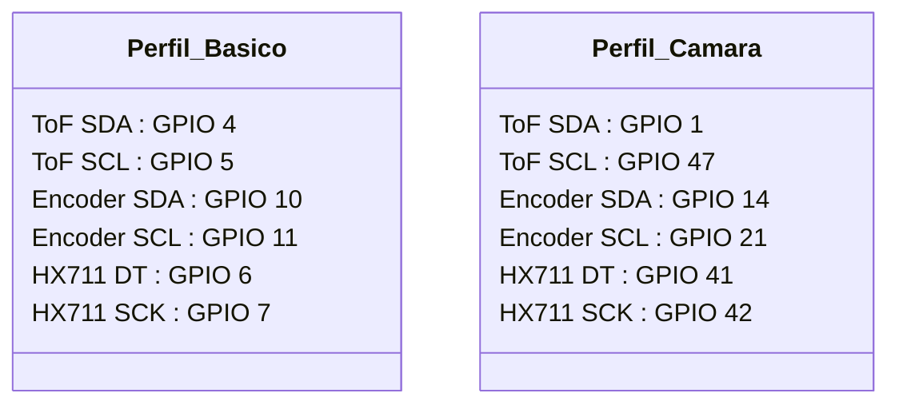

# 🔬 Visor del Proyecto — Physys Lab UMNG

Este panel interactivo es tu **pantalla de control**. Muestra el estado real de tu proyecto, describe qué hace cada uno de tus planes de desarrollo en `Planes_AI/` y te permite guiar de forma segura las etapas de desarrollo.

---

## 📈 1. Estado y Evolución Reciente (v9.3)

* **Placa en Uso:** ESP32-S3 DevKit (sin PSRAM física externa detectada, lo cual se gestiona en memoria RAM interna).
* **Firmware Actual:** Compilado e instalado en `0x00010000`. Cuenta con el control de excepciones para bus I2C (previene bloqueos si no hay sensores cableados).
* **Sistema de Archivos (LittleFS):** Subido en `0x00610000` con todos los archivos web pre-comprimidos con **GZIP** (`index.html.gz`, `app.js.gz`, etc.), lo que reduce el consumo de memoria RAM un 80% y previene caídas del portal cautivo.

---

## 📂 2. Mapa del Tesoro: Archivos de Planes (`Planes_AI/`)

Here is the complete list of plans documenting the evolution of the project. You can open them in your local VS Code to read them in detail:

| Nombre del Archivo | Propósito y Contenido Clave | Estado |
| :--- | :--- | :--- |
| [Plan_Quemado_Hardware.md](file:///c:/Users/nelso/Documents/A_UMNG/ESP32S3%20PHYSYS%20LAB/Planes_AI/Plan_Quemado_Hardware.md) | Guía paso a paso para compilar y flashear el Firmware (`upload`) y la Web (`uploadfs`). | 🔒 **Completado y Verificado** |
| [PLAN_SOLUCION_V9.3_BOOTLOOP.md](file:///c:/Users/nelso/Documents/A_UMNG/ESP32S3%20PHYSYS%20LAB/Planes_AI/PLAN_SOLUCION_V9.3_BOOTLOOP.md) | Diagnóstico del crash del watchdog. Detalla el uso de GZIP para evitar desbordamientos de memoria RAM. | 🔒 **Implementado con éxito** |
| [GUIA_PINES_Y_RESTRICCIONES.md](file:///c:/Users/nelso/Documents/A_UMNG/ESP32S3%20PHYSYS%20LAB/Planes_AI/GUIA_PINES_Y_RESTRICCIONES.md) | Reglas de asignación segura de GPIOs para evitar colisiones con la cámara y chips PSRAM Octal. | 🧭 **Guía de Referencia** |
| [PROPUESTA_PINOUTS_DINAMICOS.md](file:///c:/Users/nelso/Documents/A_UMNG/ESP32S3%20PHYSYS%20LAB/Planes_AI/PROPUESTA_PINOUTS_DINAMICOS.md) | Arquitectura del firmware adaptativo único usando NVS (`Preferences`) para múltiples perfiles de placa. | 💡 **Propuesta Técnica** |
| [PLAN_V9.3_MULTIUSUARIO_Y_PINES.md](file:///c:/Users/nelso/Documents/A_UMNG/ESP32S3%20PHYSYS%20LAB/Planes_AI/PLAN_V9.3_MULTIUSUARIO_Y_PINES.md) | Control de accesos mediante WebSocket (Roles de Docente y Líder de Mesa con PIN `Umng-2026`). | 🔒 **Implementado** |
| [INFORME_EVOLUCION_PRODUCCION.md](file:///c:/Users/nelso/Documents/A_UMNG/ESP32S3%20PHYSYS%20LAB/Planes_AI/INFORME_EVOLUCION_PRODUCCION.md) | Resumen del avance y madurez de cada entrega (v9.0 a v9.3). | 📝 **Histórico** |
| [CHECKLIST_DESARROLLO_V9.md](file:///c:/Users/nelso/Documents/A_UMNG/ESP32S3%20PHYSYS%20LAB/Planes_AI/CHECKLIST_DESARROLLO_V9.md) | Seguimiento de pendientes y tareas completadas del roadmap de desarrollo. | 📝 **Control** |

---

## 🗺️ 3. Distribución de Pines: Comparativa de Perfiles

El sistema utiliza las variables de memoria no volátil (NVS) para configurar dinámicamente los buses en el arranque. Estos son los dos perfiles principales cargados en tu firmware:

> [!WARNING]
> **Peligro en Pines 35, 36 y 37:** Estos pines están físicamente conectados a la PSRAM Octal en placas N16R8. Nunca intentes configurarlos como entrada/salida física o causarán un crash inmediato del sistema. En el GPIO Viewer los mostraremos únicamente con etiqueta visual segura sin lectura física.

---

## 🔄 4. Centro de Comandos Seguros

Para tu completa tranquilidad, estos son los comandos exactos que podemos ejecutar para verificar el estado de los componentes. Ninguno realiza escrituras en tus archivos:

1. **Actualizar el mapa de arquitectura (`Graphify`):**
   - Comando: `graphify update ./`
   - Propósito: Analiza la estructura del proyecto y regenera el mapa en `graphify-out/graph.json`.
2. **Escanear dispositivos PlatformIO:**
   - Comando: `pio device list`
   - Propósito: Detecta en qué puerto COM está conectada la placa en tu PC.

---
*Este panel es de lectura y se actualiza según avancemos. Si deseas ver o discutir el código de alguno de los planes de `Planes_AI/` directamente aquí en el chat, solo pídemelo.*
