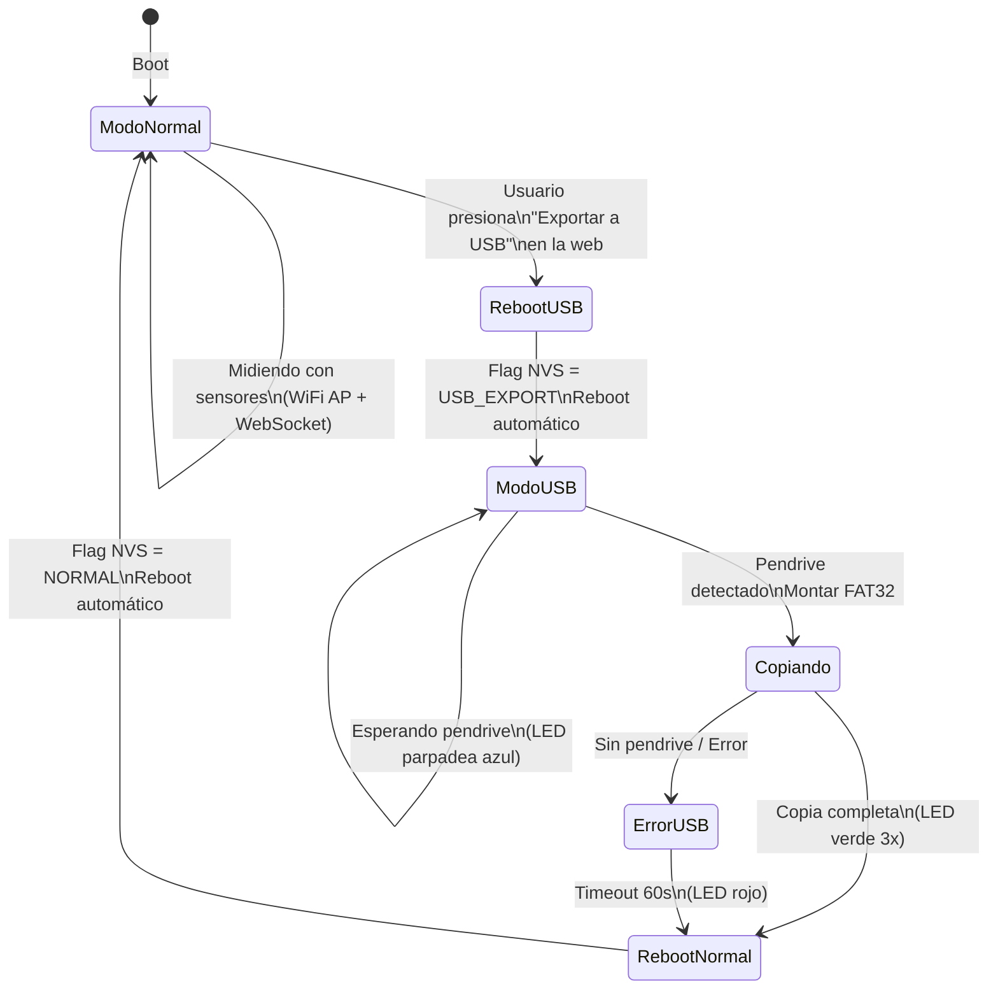
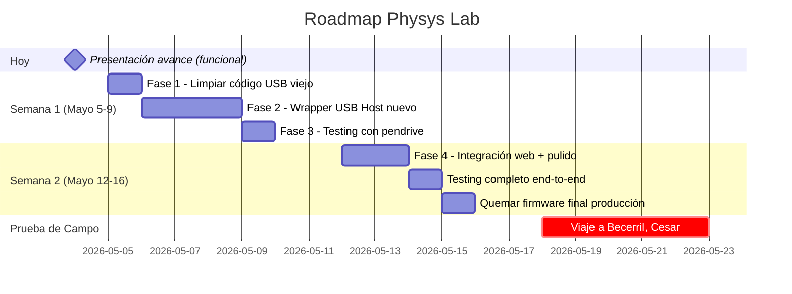

# 🔌 Plan USB Host MSC — Arquitectura Híbrida para Campo

## Contexto de Uso Real

```
📍 Becerril, Cesar, Colombia — Zona rural
👨‍🏫 Estudiantes de física en campo
📱 Solo celular disponible (sin PC)
⏰ Prueba en ~15 días (mediados de mayo 2026)
```

**Escenario real:**
1. En laboratorio (UMNG): quemamos firmware → probamos → ajustamos
2. Llevamos ESP32-S3 a zona rural
3. Estudiantes se conectan por WiFi al ESP32-S3 desde celular
4. Miden con sensores, ven datos en tiempo real en la web app
5. Datos se guardan en partición interna (`DataFS` — 4MB)
6. **NUEVO**: Al terminar la jornada, conectan pendrive y exportan todo

---

## 🔄 Flujo del Modo Híbrido



### Paso a paso para el estudiante:
1. En la app web → toca **"📥 Exportar a USB"**
2. La app muestra: *"Conecta el pendrive y espera..."*
3. ESP32 se reinicia (LED amarillo parpadeando)
4. Estudiante conecta pendrive USB al ESP32 (con cable OTG)
5. LED azul = copiando datos
6. LED verde 3 parpadeos = ¡Listo! Retira el pendrive
7. ESP32 se reinicia solo a modo normal
8. La app web vuelve a estar disponible

**Tiempo total estimado: ~30 segundos** (reboot + copia + reboot)

---

## 🏗️ Implementación Técnica

### Fase 1: Flag NVS para modo de boot
```cpp
// En setup(), antes de todo:
preferences.begin("physys", true);
String bootMode = preferences.getString("boot_mode", "normal");
preferences.end();

if (bootMode == "usb_export") {
    // → Entrar en modo USB Host (Fase 2)
    runUsbExportMode();
    // Al terminar, volver a normal
    preferences.begin("physys", false);
    preferences.putString("boot_mode", "normal");
    preferences.end();
    ESP.restart();  // Reboot a modo normal
}
// Si no, continuar con setup() normal...
```

### Fase 2: Modo USB Export (función separada)
```cpp
void runUsbExportMode() {
    // 1. Iniciar LED (amarillo = preparando)
    FastLED.addLeds<WS2812, LED_PIN, GRB>(leds, NUM_LEDS);
    setLED(CRGB::Yellow);
    
    // 2. Montar DataFS para leer datos
    DataFS.begin(false, "/data", 10, "userdata");
    
    // 3. Iniciar USB Host stack (ESP-IDF nativo)
    usbHostInit();  // Nuevo wrapper
    
    // 4. Esperar pendrive (timeout 60s)
    setLED(CRGB::Blue);  // Azul parpadeo = esperando
    unsigned long start = millis();
    while (!usbHost.isConnected() && millis() - start < 60000) {
        usbHost.poll();
        blinkLED(CRGB::Blue, 1, 500);
    }
    
    if (!usbHost.isConnected()) {
        blinkLED(CRGB::Red, 5, 200);  // Error
        return;
    }
    
    // 5. Montar FAT32 del pendrive
    usbHost.mount();
    
    // 6. Copiar TODOS los archivos de DataFS a USB
    File root = DataFS.open("/");
    File file = root.openNextFile();
    while (file) {
        copyFileToUsb(file.name(), file);
        file = root.openNextFile();
    }
    
    // 7. Crear índice con metadata
    writeExportManifest();
    
    // 8. Desmontar USB seguro
    usbHost.unmount();
    
    // 9. Señal de éxito
    blinkLED(CRGB::Green, 3, 300);
    delay(2000);
}
```

### Fase 3: Trigger desde la Web

**WebSocket command nuevo:**
```cpp
else if (msg == "USB_EXPORT") {
    // Guardar flag y reiniciar
    preferences.begin("physys", false);
    preferences.putString("boot_mode", "usb_export");
    preferences.end();
    ws.textAll("{\"status\":\"usb_export_starting\"}");
    delay(500);
    ESP.restart();
}
```

**En la interfaz web (app.js):**
```javascript
// Botón "Exportar a USB"
function exportToUsb() {
    if (confirm('¿Conectar pendrive y exportar datos?\nEl dispositivo se reiniciará.')) {
        ws.send('USB_EXPORT');
        showNotification('Reiniciando para exportar... Conecta el pendrive.');
    }
}
```

### Fase 4: Nuevo Wrapper USB Host (lib/)

```
lib/
└── PhysysUSB/
    ├── library.json
    ├── PhysysUSB.h        ← API limpia
    └── PhysysUSB.cpp      ← Implementación ESP-IDF nativa
```

**Build flags condicionales** (en `platformio.ini`):
```ini
; No cambiar los flags actuales - el modo se maneja en runtime
; via NVS flag + reconfiguración dinámica del USB controller
```

---

## 📁 Formato de Exportación USB

Estructura en el pendrive después de exportar:

```
PHYSYS_LAB/
├── export_20260518_1430.json    ← Manifiesto
├── exp_1716057600000.json       ← Experimento 1
├── exp_1716058200000.json       ← Experimento 2
├── exp_1716059400000.json       ← Experimento 3
└── ...
```

**Manifiesto (`export_YYYYMMDD_HHMM.json`):**
```json
{
    "device": "Physys-Lab-A3B2",
    "firmware": "v1.0",
    "export_time": 1716057600,
    "location": "Becerril, Cesar",
    "files_count": 12,
    "total_bytes": 45230,
    "experiments": [
        {"name": "exp_1716057600000.json", "size": 3420},
        {"name": "exp_1716058200000.json", "size": 5100}
    ]
}
```

---

## 🗓️ Timeline



---

## 🔮 Roadmap Futuro (Post-Campo)

| Feature | Prioridad | Cuándo |
|---|---|---|
| USB Export a pendrive | 🔴 Antes del campo | Semana 1-2 |
| OTA desde celular (WiFi) | 🟡 Post-campo | Junio 2026 |
| Sync Firebase (cuando hay internet) | 🟢 Ya implementado | ✅ Listo |
| timer_u32 (cronómetro precisión) | ⚪ Si se necesita | Según feedback |
| Múltiples ESP32 en red mesh | 🔵 Futuro | Según demanda |

### Sobre OTA desde celular:
Esto es factible y lo podemos implementar post-campo:
1. Estudiante/profesor descarga `.bin` al celular
2. Se conecta al WiFi del ESP32
3. Sube el `.bin` via la web app (`/api/ota`)
4. ESP32 hace update y reinicia
5. **Sin necesidad de PC ni PlatformIO en campo**

---

## ⚠️ Riesgos y Mitigaciones

| Riesgo | Probabilidad | Mitigación |
|---|---|---|
| Pendrive no es FAT32 | Media | Documentar: "Solo FAT32, <32GB" |
| Cable OTG incompatible | Baja | Llevar 3 cables de respaldo |
| Pendrive consume mucha corriente | Media | Usar SanDisk Ultra Fit (bajo consumo) |
| Datos se pierden sin USB | Baja | DataFS tiene 4MB (~100+ experimentos) |
| ESP32 no sale del modo USB | Baja | Timeout 60s + factory reset (BOOT 10s) |

> [!IMPORTANT]
> **Para mañana:** Lleva la carpeta `produccion` tal cual está. Todo funciona. El USB Export lo implementamos durante la semana 1-2 antes del viaje a Becerril.
