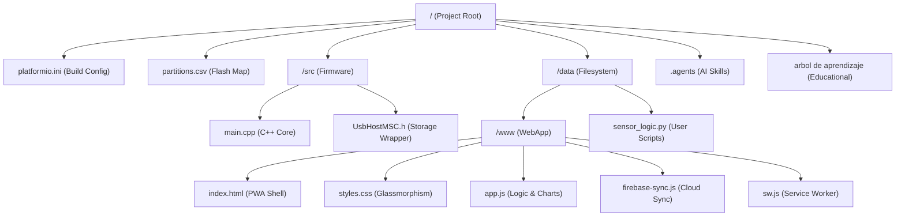
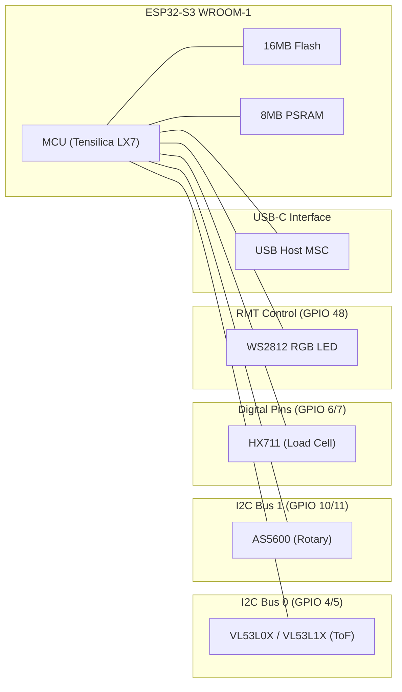
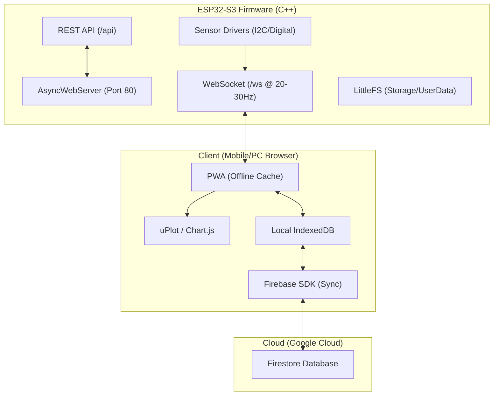
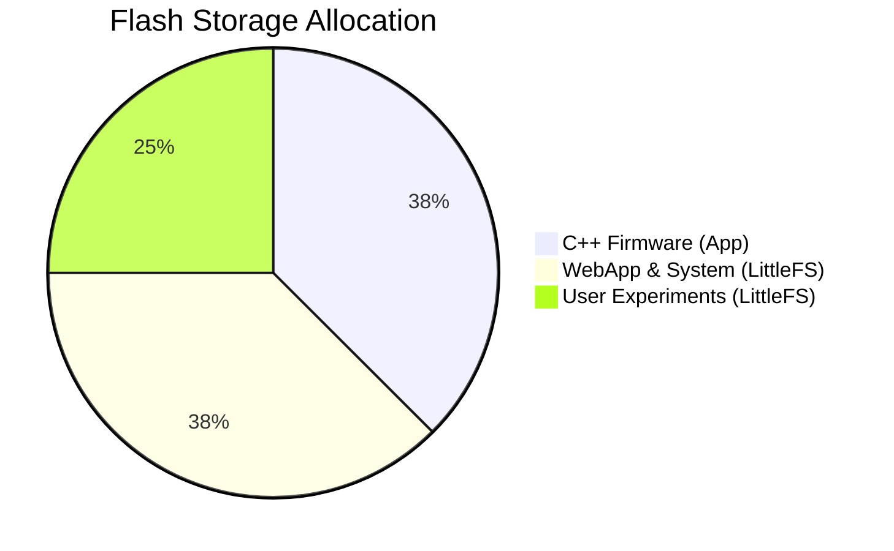
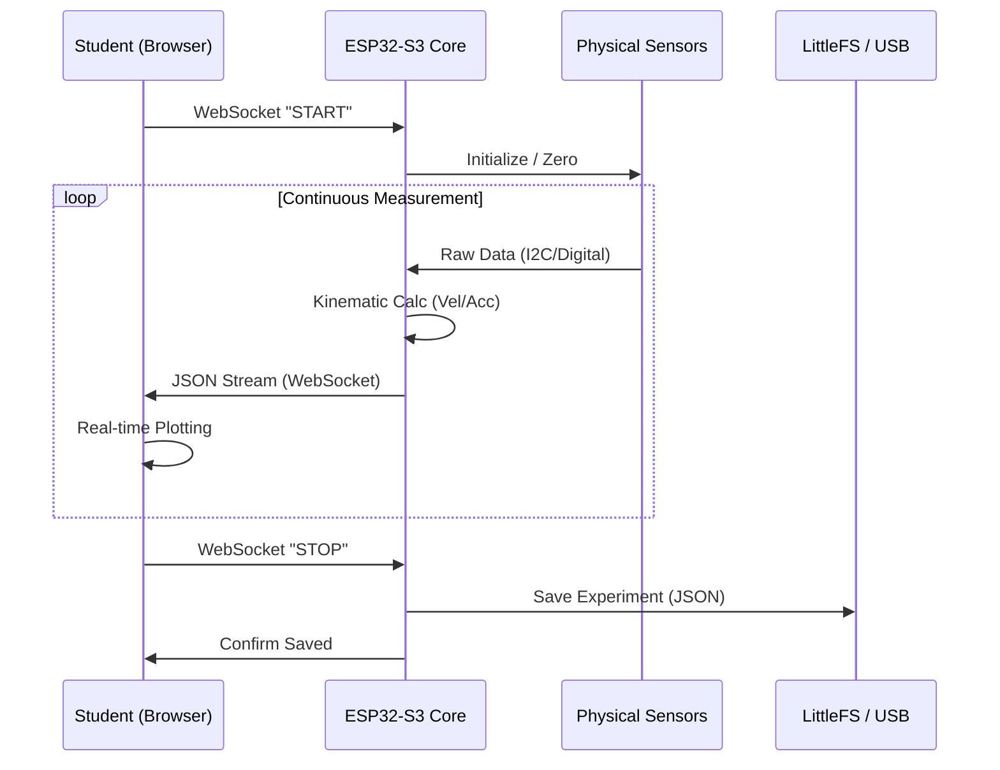

# 🏗️ Physys Lab Architecture — Graphify Report

This document provides a visual and technical overview of the **Physys Lab v7.0** system, an offline-first physics measurement laboratory built on the ESP32-S3.

---

## 1. 📂 Repository Structure
A logical map of the project files and their roles in the ecosystem.

---

## 2. 🔌 Hardware Architecture
How the ESP32-S3 WROOM-1 interacts with its sensors and indicators.

---

## 3. 🌐 Software Layers & Communication
The multi-layer stack from low-level drivers to cloud synchronization.

---

## 💾 Memory Partitioning (16MB Flash)
Visual breakdown of the `partitions.csv` configuration.

---

## 🔄 Measurement Lifecycle
The sequence of events during a single experiment.

---

## 🚦 System Status Codes (LED)
| Color | Meaning | Action |
|-------|---------|--------|
| ⚪ White | Ready / Idle | System is waiting for connection |
| 🔵 Blue | Measuring | Real-time streaming active |
| 🟢 Green | Success | Experiment saved or synced |
| 🟡 Yellow | Warning | Memory nearly full |
| 🟣 Magenta | Script Error | Python logic failed (H3) |
| 🔴 Red | Critical | Battery low or hardware failure |
