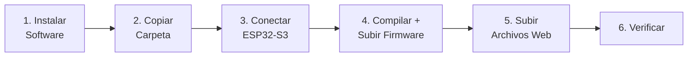

# 🔥 Plan de Quemado — Physys Lab en ESP32-S3 Nuevo

> Guía completa para flashear desde cero en **otro computador**, usando únicamente la carpeta `produccion`.

---

## 📋 Resumen del Proceso



---

## Paso 0 — ¿Qué contiene la carpeta `produccion`?

| Archivo/Carpeta | Propósito |
|---|---|
| `platformio.ini` | Configuración del board, librerías, y flags de compilación |
| `partitions.csv` | Tabla de particiones personalizada (16MB flash) |
| `src/main.cpp` | Firmware principal del ESP32-S3 |
| `src/UsbHostMSC.h` | Header para almacenamiento USB Host |
| `data/www/` | Interfaz web (HTML, CSS, JS) → se sube como LittleFS |
| `data/config.json` | Configuración de sensores |
| `data/sensor_logic.py` | Lógica de sensores (almacenada en flash) |
| `include/` | Documentación del sistema |
| `lib/` | Vacío (las librerías se descargan automáticamente via `lib_deps`) |

> [!IMPORTANT]
> La carpeta `produccion` es **100% autocontenida**. No necesitas ningún otro archivo del repositorio original. Las librerías se descargan automáticamente al compilar por primera vez.

---

## Paso 1 — Instalar Software en el Nuevo Computador

### 1.1 Instalar Python (3.8+)

1. Descargar desde [python.org/downloads](https://www.python.org/downloads/)
2. **IMPORTANTE:** Marcar ☑️ **"Add Python to PATH"** durante la instalación
3. Verificar:
   ```powershell
   python --version
   ```

### 1.2 Instalar PlatformIO Core (CLI)

```powershell
pip install platformio
```

Verificar instalación:
```powershell
pio --version
```

> [!TIP]
> **Alternativa más visual:** Si prefieres interfaz gráfica, instala [VS Code](https://code.visualstudio.com/) + la extensión **PlatformIO IDE**. Esto instala PlatformIO automáticamente y te da botones para compilar/subir.

### 1.3 Instalar Driver USB (si es necesario)

| Sistema Operativo | ¿Necesita driver? |
|---|---|
| **Windows 10/11** | Generalmente NO (el driver CP210x/CH340 se instala automáticamente) |
| **Windows 7/8** | Sí — descargar [CP210x Driver](https://www.silabs.com/developers/usb-to-uart-bridge-vcp-drivers) |
| **Linux** | NO (soporte nativo) |
| **macOS** | Generalmente NO |

> [!NOTE]
> Tu ESP32-S3 usa **USB CDC nativo** (`ARDUINO_USB_CDC_ON_BOOT=1`), por lo que en la mayoría de casos Windows lo reconoce directamente como puerto COM sin drivers adicionales. Si no aparece, revisa la sección de Troubleshooting al final.

---

## Paso 2 — Copiar la Carpeta `produccion` al Nuevo PC

### Opción A: USB
Copia la carpeta `produccion` completa a cualquier ubicación en el nuevo PC. Por ejemplo:
```
C:\PhysysLab\
```

### Opción B: Git (si el repo está accesible)
```powershell
git clone <url-del-repo>
cd "ESP32S3 PHYSYS LAB\produccion"
```

### Estructura esperada en el nuevo PC:
```
C:\PhysysLab\
├── platformio.ini          ← Configuración del proyecto
├── partitions.csv          ← Tabla de particiones (16MB)
├── README_INSTALACION.md   ← Guía rápida
├── src/
│   ├── main.cpp            ← Firmware principal
│   └── UsbHostMSC.h        ← Header USB
├── data/
│   ├── config.json
│   ├── sensor_logic.py
│   └── www/
│       ├── index.html      ← Interfaz web
│       ├── styles.css
│       ├── app.js
│       ├── firebase-sync.js
│       ├── manifest.json
│       └── sw.js
├── include/
└── lib/                    ← Vacío (las libs se bajan solas)
```

---

## Paso 3 — Conectar el ESP32-S3

### 3.1 Conexión física
1. Conectar el ESP32-S3 al PC con un cable **USB-C** (asegúrate de que sea un cable de **datos**, no solo de carga)
2. Usar el **puerto USB marcado como "USB"** en la placa (NO el marcado "UART")

### 3.2 Verificar que el PC lo reconoce

```powershell
# Listar puertos disponibles
pio device list
```

Deberías ver algo como:
```
COM3
----
Hardware ID: USB VID:PID=303A:1001
Description: USB JTAG/serial debug unit
```

> [!WARNING]
> Si **no aparece ningún puerto COM**, intenta:
> 1. Usar otro cable USB (muchos cables son solo de carga)
> 2. Probar otro puerto USB del PC
> 3. Poner el ESP32 en **modo BOOT**: mantener presionado **BOOT** → presionar **RESET** → soltar **BOOT**
> 4. Verificar en Administrador de Dispositivos (devmgmt.msc) si aparece un dispositivo desconocido

---

## Paso 4 — Compilar y Subir el Firmware

### 4.1 Abrir terminal en la carpeta

```powershell
cd C:\PhysysLab     # o donde hayas puesto la carpeta produccion
```

### 4.2 Primera compilación (descarga de dependencias)

```powershell
pio run
```

> [!NOTE]
> La **primera vez** tarda varios minutos porque PlatformIO descarga automáticamente:
> - La toolchain de ESP32 (compilador, esptool, etc.)
> - El framework Arduino para ESP32-S3
> - Todas las librerías listadas en `lib_deps` (ESPAsyncWebServer, ArduinoJson, VL53L0X, HX711, FastLED, etc.)
>
> Las compilaciones siguientes serán mucho más rápidas.

**Resultado esperado:**
```
SUCCESS
========================= [SUCCESS] Took XX.XXs =========================
```

### 4.3 Subir firmware al ESP32-S3

```powershell
pio run -t upload
```

Si el puerto no se detecta automáticamente, especifícalo:
```powershell
pio run -t upload --upload-port COM3
```

> [!IMPORTANT]
> **Si la carga se queda esperando "Connecting...":**
> 1. Mantén presionado el botón **BOOT** en el ESP32
> 2. Presiona una vez **RESET** (sin soltar BOOT)
> 3. Suelta **BOOT**
> 4. La carga debería iniciar
>
> Esto solo es necesario la primera vez o si el bootloader no está configurado para auto-reset.

**Resultado esperado:**
```
Writing at 0x00010000... (1 %)
Writing at 0x00020000... (3 %)
...
Hard resetting via RTS pin...
========================= [SUCCESS] Took XX.XXs =========================
```

---

## Paso 5 — Subir el Sistema de Archivos (Interfaz Web)

```powershell
pio run -t uploadfs
```

Si necesitas especificar puerto:
```powershell
pio run -t uploadfs --upload-port COM3
```

> [!IMPORTANT]
> Este paso sube toda la carpeta `data/` (incluyendo `www/` con la interfaz web) como una imagen **LittleFS** a la partición `storage` del ESP32. **Sin este paso, la interfaz web no funcionará.**

**Resultado esperado:**
```
Building LittleFS image from 'data' directory...
Uploading...
========================= [SUCCESS] Took XX.XXs =========================
```

> [!TIP]
> Si el `uploadfs` falla con un error de "modo BOOT", repite el truco BOOT + RESET igual que en el paso 4.3.

---

## Paso 6 — Verificación

### 6.1 Monitor Serial
```powershell
pio device monitor
```

Deberías ver logs como:
```
Physys Lab - Iniciando...
[WiFi] AP 'Physys-Lab-XXXX' activo en 192.168.4.1
[mDNS] Respondiendo en http://physyslab.local
[HTTP] Servidor activo en puerto 80
```

> Para salir del monitor: `Ctrl + C`

### 6.2 Conectarse a la Interfaz Web
1. En tu celular o PC, buscar la red WiFi **"Physys-Lab-XXXX"** (las XXXX corresponden a los últimos dígitos de la dirección MAC del ESP32).
2. Conectarse (red abierta por defecto, o con la contraseña definida en `config.json`).
3. Abrir el navegador e ir a: **http://physyslab.local** (o a **http://192.168.4.1** si tu dispositivo no soporta nombres locales).
4. Verificar que la interfaz web (v8.0) carga correctamente.

---

## 🛠️ Troubleshooting

### Problema: "No se encuentra el puerto COM"

| Causa | Solución |
|---|---|
| Cable de solo carga | Usar cable USB de datos |
| Puerto incorrecto en la placa | Usar el puerto **USB** (no UART) |
| Driver faltante | Instalar driver CP210x/CH340 |
| Dispositivo no reconocido | Poner en modo BOOT manualmente |

### Problema: "Error de compilación"

```powershell
# Limpiar y recompilar desde cero
pio run -t clean
pio run
```

### Problema: "Error al subir — espacio insuficiente"

> Esto no debería pasar con la tabla de particiones personalizada (6MB app + 6MB storage), pero si ocurre:

```powershell
# Borrar toda la flash y empezar limpio
pio run -t erase
pio run -t upload
pio run -t uploadfs
```

### Problema: "La interfaz web no carga (404)"

Asegúrate de haber ejecutado `pio run -t uploadfs`. El firmware sin el filesystem no tiene archivos web.

### Problema: "El ESP32 no arranca / boot loop"

1. Conectar al monitor serial para ver el error
2. Verificar que el ESP32-S3 tenga **16MB de flash** (algunos modelos tienen 4MB o 8MB)
3. Si tiene menos de 16MB, la tabla de particiones no es compatible

---

## 📝 Resumen Rápido (Cheat Sheet)

```powershell
# === EN EL NUEVO PC ===

# 1. Instalar PlatformIO
pip install platformio

# 2. Ir a la carpeta produccion
cd C:\PhysysLab

# 3. Compilar (primera vez descarga todo)
pio run

# 4. Subir firmware
pio run -t upload

# 5. Subir interfaz web (LittleFS)
pio run -t uploadfs

# 6. Verificar
pio device monitor
```

> [!CAUTION]
> **Orden obligatorio:** Siempre subir el **firmware primero** (paso 4) y luego el **filesystem** (paso 5). Si inviertes el orden, el firmware podría sobrescribir la partición de archivos.

---

## 📐 Mapa de Memoria del ESP32-S3 (16MB)

```
┌──────────────────────────────────┐ 0x000000
│         Bootloader               │ 
├──────────────────────────────────┤ 0x009000
│         NVS (16KB)               │
├──────────────────────────────────┤ 0x00D000
│         OTA Data (8KB)           │
├──────────────────────────────────┤ 0x010000
│                                  │
│      Firmware (app0) — 6MB       │  ← pio run -t upload
│                                  │
├──────────────────────────────────┤ 0x610000
│                                  │
│    LittleFS (storage) — 6MB      │  ← pio run -t uploadfs
│    (interfaz web + config)       │
│                                  │
├──────────────────────────────────┤ 0xC10000
│    User Data — ~4MB              │
│    (datos de experimentos)       │
└──────────────────────────────────┘ 0xFFFFFF
```
